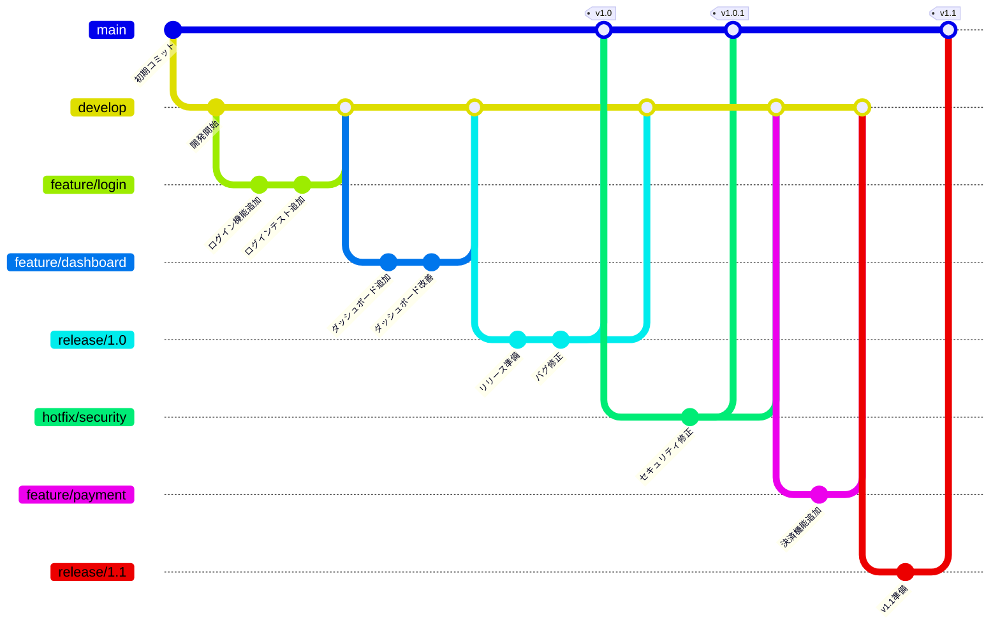

# GitFlow

GitFlowは、Vincent Driessenによって提案されたブランチモデルです。main、develop、feature、release、hotfixの5種類のブランチを使用します。

```mermaid
gitGraph
    commit id: "初期コミット"
    branch develop
    checkout develop
    commit id: "開発開始"
    
    branch feature/login
    checkout feature/login
    commit id: "ログイン機能追加"
    commit id: "ログインテスト追加"
    checkout develop
    merge feature/login
    
    branch feature/dashboard
    checkout feature/dashboard
    commit id: "ダッシュボード追加"
    commit id: "ダッシュボード改善"
    checkout develop
    merge feature/dashboard
    
    branch release/1.0
    checkout release/1.0
    commit id: "リリース準備"
    commit id: "バグ修正"
    checkout main
    merge release/1.0 tag: "v1.0"
    checkout develop
    merge release/1.0
    
    checkout main
    branch hotfix/security
    checkout hotfix/security
    commit id: "セキュリティ修正"
    checkout main
    merge hotfix/security tag: "v1.0.1"
    checkout develop
    merge hotfix/security
    
    checkout develop
    branch feature/payment
    checkout feature/payment
    commit id: "決済機能追加"
    checkout develop
    merge feature/payment
    
    branch release/1.1
    checkout release/1.1
    commit id: "v1.1準備"
    checkout main
    merge release/1.1 tag: "v1.1"
```
