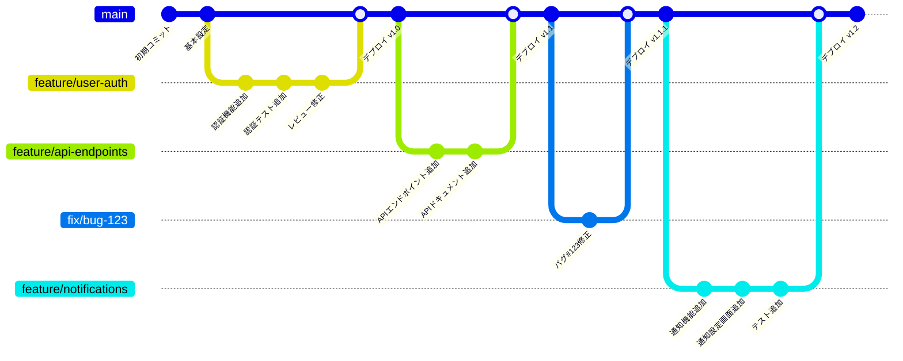

# GitHubFlow

GitHubFlowは、GitHubで採用されているシンプルなブランチモデルです。mainブランチと機能ブランチのみを使用し、プルリクエストを通じてマージします。

```mermaid
gitGraph
    commit id: "初期コミット"
    commit id: "基本設定"
    
    branch feature/user-auth
    checkout feature/user-auth
    commit id: "認証機能追加"
    commit id: "認証テスト追加"
    commit id: "レビュー修正"
    checkout main
    merge feature/user-auth
    commit id: "デプロイ v1.0"
    
    branch feature/api-endpoints
    checkout feature/api-endpoints
    commit id: "APIエンドポイント追加"
    commit id: "APIドキュメント追加"
    checkout main
    merge feature/api-endpoints
    commit id: "デプロイ v1.1"
    
    branch fix/bug-123
    checkout fix/bug-123
    commit id: "バグ#123修正"
    checkout main
    merge fix/bug-123
    commit id: "デプロイ v1.1.1"
    
    branch feature/notifications
    checkout feature/notifications
    commit id: "通知機能追加"
    commit id: "通知設定画面追加"
    commit id: "テスト追加"
    checkout main
    merge feature/notifications
    commit id: "デプロイ v1.2"
```