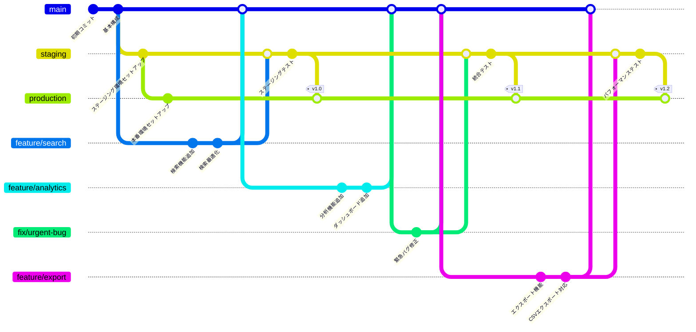

# GitLabFlow

GitLabFlowは、GitLabで採用されているブランチモデルです。環境ブランチ（production、staging）を使用して、段階的なデプロイを管理します。

```mermaid
gitGraph
    commit id: "初期コミット"
    commit id: "基本構成"
    
    branch staging
    checkout staging
    commit id: "ステージング環境セットアップ"
    
    branch production
    checkout production
    commit id: "本番環境セットアップ"
    
    checkout main
    branch feature/search
    checkout feature/search
    commit id: "検索機能追加"
    commit id: "検索最適化"
    checkout main
    merge feature/search
    
    checkout staging
    merge feature/search
    commit id: "ステージングテスト"
    
    checkout production
    merge staging tag: "v1.0"
    
    checkout main
    branch feature/analytics
    checkout feature/analytics
    commit id: "分析機能追加"
    commit id: "ダッシュボード追加"
    checkout main
    merge feature/analytics
    
    branch fix/urgent-bug
    checkout fix/urgent-bug
    commit id: "緊急バグ修正"
    checkout main
    merge fix/urgent-bug
    
    checkout staging
    merge fix/urgent-bug
    commit id: "統合テスト"
    
    checkout production
    merge staging tag: "v1.1"
    
    checkout main
    branch feature/export
    checkout feature/export
    commit id: "エクスポート機能"
    commit id: "CSVエクスポート対応"
    checkout main
    merge feature/export
    
    checkout staging
    merge feature/export
    commit id: "パフォーマンステスト"
    
    checkout production
    merge staging tag: "v1.2"
```