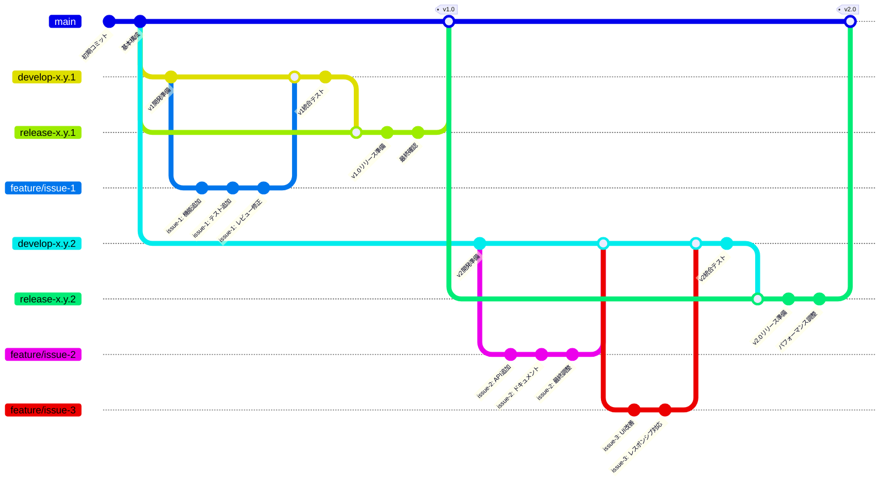

# 変形GitFlow（並列開発版）

複数のdevelopブランチを使用して並列開発を行う例です。同じmainコミットから複数のdevelopブランチを切り、それぞれで独立した機能開発を行います。

```mermaid
gitGraph
    commit id: "初期コミット"
    commit id: "基本構成"

    branch develop-x.y.1
    branch release-x.y.1    
    
    checkout develop-x.y.1
    commit id: "v1開発準備"
    branch feature/issue-1
    
    checkout main
    branch develop-x.y.2

    checkout feature/issue-1
    commit id: "issue-1: 機能追加"
    commit id: "issue-1: テスト追加"
    commit id: "issue-1: レビュー修正"
    checkout develop-x.y.1
    merge feature/issue-1
    commit id: "v1統合テスト"
    
    checkout release-x.y.1
    merge develop-x.y.1
    commit id: "v1.0リリース準備"
    commit id: "最終確認"

    checkout main
    merge release-x.y.1 tag: "v1.0"
    
    branch release-x.y.2
    
    checkout develop-x.y.2
    commit id: "v2開発準備"
    branch feature/issue-2
    checkout feature/issue-2
    commit id: "issue-2: API追加"
    commit id: "issue-2: ドキュメント"
    commit id: "issue-2: 最終調整"
    checkout develop-x.y.2
    merge feature/issue-2
    
    branch feature/issue-3
    checkout feature/issue-3
    commit id: "issue-3: UI改善"
    commit id: "issue-3: レスポンシブ対応"
    checkout develop-x.y.2
    merge feature/issue-3
    commit id: "v2統合テスト"
    
    checkout release-x.y.2
    merge develop-x.y.2
    commit id: "v2.0リリース準備"
    commit id: "パフォーマンス調整"
    checkout main
    merge release-x.y.2 tag: "v2.0"
```