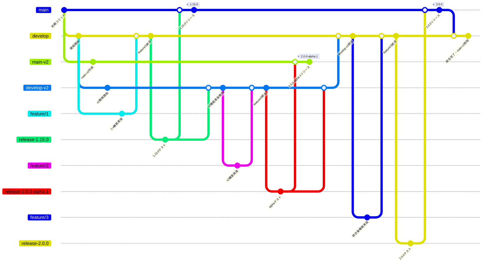

# 変形GitFlow（v2ブランチ併用版）

後方互換性のない大幅な改修に対応するため、通常のGitFlowに加えてv2バージョンのブランチを並行運用するワークフローです。

## 運用ルール

### 通常フロー

1. `develop` で開発
1. `release-{バージョン名}` でテスト
1. リリース判定
1. `main` にマージ
1. `main` から `{バージョン名}` のタグを切る
   - バージョン名: 1.15.0、1.16.0、...

### v2開発フロー（後方互換性のない改修）

1. `feature/{番号}` で詳細設計・実装
1. `develop-v2` で開発
1. `release-{バージョン名}` でテスト
1. リリース判定
1. `main-v2` にマージ
1. `main-v2` から `{バージョン名}` のタグを切る
   - バージョン名: 2.0.0-alpha.1、2.0.0-alpha.2、...（alpha リリース）
1. `main` の内容は適宜 `develop-v2` にも取り込む
1. v2開発完了後に `develop-v2` を `develop` にマージ
1. 統合版を `main` にマージし、`main-v2` を削除

## 特徴

- **二重ブランチ構造**: 通常開発（1.x系）と後方互換性のない改修（2.x系）を並行運用
- **段階的統合**: mainの変更は定期的にdevelop-v2にも取り込み、互換性を保つ
- **アルファリリース**: main-v2では2.0.0-alpha.xでプレリリース版をリリース
- **最終統合**: develop-v2をdevelopにマージ後、統合版をmainにリリース
- **ブランチ削除**: 統合完了後にmain-v2を削除し、単一ブランチ構造に戻す
